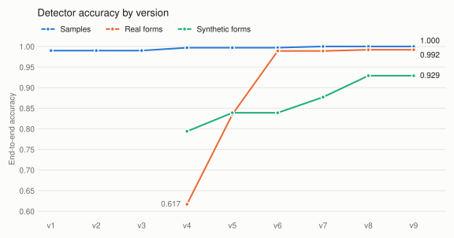

# Checkbox detection

## Approach and results

First I built a baseline detector (v1) with OpenCV that got 0.990 on the 4 provided samples. Since that was already a good start, I discarded other alternatives like an LLM or a trained model. An LLM
would be expensive and slow, and I didn't have enough data to train a model.

But 4 images aren't enough to know if it works on other forms, so I set up a benchmark first: I downloaded more
appraisal forms from the internet (filled and blank templates) and generated synthetic filled forms, then labeled
them and correct them manually with Label Studio. Running the baseline on them confirmed what I thought, it wasn't good enough for other forms.

Only then I started optimizing. I'm not a computer vision expert, so I used Claude to help me find why the detector
was failing and try different techniques, keeping only the changes that improved the benchmark. The benchmark measures end-to-end accuracy (box found
and correctly classified) on the 4 provided samples, the real forms and the synthetic forms:

<picture>
  <source media="(prefers-color-scheme: dark)" srcset="docs/accuracy-dark.svg">
  
</picture>

The final version gets every box right on the samples, 99.2% on the real forms and 92.9% on the synthetic ones,
which are much harder on purpose. Each commit message explains what that version fixed, the alternatives I
rejected and the before/after numbers.

There are still some limitations (see
`backend/evaluations/known-issues.md`), but it's clear how to address them: a small CNN that checks each box the
detector finds (checked / unchecked / not a box), trained on synthetic data, would fix most of them.

## Frontend and deployment

After getting good results, I focused on the user experience: I built a frontend so anyone can try the detector
and check that it's working correctly.

And to show that I can take things to production, I used Terraform and AWS to deploy the whole app, so it's live at https://homevision.alexisherrera.dev.
